# System Design — Canon × Skill × Open Distribution

This document describes the system that the AI-Native Architect skill is one part of: how a **canon**
(the methodology), an **executable skill**, and an **open distribution** fit together, how they stay in
sync, and the principles that hold the whole thing together. It is the "make a system design" deliverable
for the project, and it doubles as a contributor's mental model.

## 1. The problem the system solves

There is a recurring failure in how organizations meet AI: they treat "an organization that uses AI" as
"an AI-Native organization." The difference is one of **kind**, not degree, and conflating them produces
expensive theater (the documented pattern: ~95% of custom enterprise AI pilots show no measurable P&L
impact over ~6 months). The methodology exists to draw the line and show the redrawn form. But a
methodology is inert: people read it and nod. The system's job is to make the methodology **operable**
without diluting it, and to **distribute** that operability openly.

So the system has three jobs, and therefore three layers:

- **Know** the right thing (the canon).
- **Do** the right thing, per organization (the skill).
- **Spread** it without gatekeeping (the open distribution).

## 2. The three layers

```mermaid
flowchart TD
  subgraph L1["LAYER 1 · THE CANON  (why / what-should-be)"]
    C["AI Native Organization Methodology<br/>single-file drawing set, SHEET 00-18<br/>T1 · 16 bottlenecks · four-layer substrate<br/>six worldviews · seven pillars · the kernel"]
  end
  subgraph L2["LAYER 2 · THE SKILL  (the executable how)"]
    S["ai-native-architect<br/>scope gate &rarr; T1 &rarr; workflow graph &rarr;<br/>four-layer substrate &rarr; depth modules &rarr; kernel"]
    B["AI-Native Architecture Blueprint<br/>(one per organization)"]
  end
  subgraph L3["LAYER 3 · DISTRIBUTION"]
    R["OSS repo (clone / fork, MIT)"]
    P["Claude Code plugin marketplace (1-click)"]
    W["Canon website · SHEET 17 item &#9313; (link + pitch)"]
  end
  V["COUNCIL VALIDATION<br/>10-role adversarial review<br/>&rarr; feedback &rarr; skill iterates<br/>(self-improving, M.06)"]
  U["USERS (founders, operators, incumbents)"]

  C -->|"faithful projection<br/>(distilled, exact vocabulary)"| S
  S --> B
  B --> U
  S -->|"scored on random cases"| V
  V -->|"systemic weaknesses"| S
  L3 --> U
  S --- L3
  W -.->|"surfaces"| S
```

### Layer 1 — The Canon (the source of truth)

The methodology is a single-file, bilingual "drawing set" of eighteen sheets, each marked with its
type so claims and evidence never blur: **definition / mechanism / proposition / framework / evidence
(with measurement basis) / inference (falsifiable) / action**. Its spine:

- **T1 (the theorem):** organization = distribution of judgment x flow of context.
- **The 16 structural bottlenecks (SHEET 04):** why "adding AI" to a legacy graph cannot move
  throughput. Each is a proof-by-negation of T1.
- **The four-layer substrate:** model / agent / context / observability.
- **The six worldviews, the seven sovereign-operator pillars, the three (four) forces** (Coase boundary,
  agency, cybernetics, judgment-scarcity economics).
- **The kernel:** the scarcity inversion that makes all of the above the *future* organizational form,
  not just a technique.

The canon is the **why** and the **what-should-be**. It does not, and should not, tell a specific
founder what to build. That is the skill's job.

### Layer 2 — The Skill (the executable how)

The skill is a faithful, distilled **projection** of the canon into an operational procedure, plus the
machinery to apply it to one concrete organization:

- A **scope gate** (Track A greenfield / Track B carve-out / out-of-scope AI-enablement / boundary) that
  refuses the wrong job honestly.
- A **design procedure** (frame the value loop → diagnose → apply T1 → redraw the workflow graph →
  specify the substrate → org form and Coase boundary → construction plan and economics → kernel check).
- **Nine conditional depth modules**, each gated by a trigger so small cases stay lean and regulated /
  high-stakes cases get the rigor they need.
- A self-check and an **output contract** that yields one artifact: an **AI-Native Architecture
  Blueprint** per organization.

The skill is the **how**, instantiated. Its output is an *instance*; the canon is the *type*.

### Layer 3 — The Open Distribution

Operability is worthless if it is locked up. The skill is distributed three ways, all open:

- **The OSS repo** (this repository, MIT): clone, read, fork, extend.
- **The Claude Code plugin marketplace**: `/plugin marketplace add watterfall/ai-native-architect` then
  one-click install. The repo is itself the marketplace (`.claude-plugin/marketplace.json` +
  `plugin.json`, skills auto-discovered from `skills/`).
- **The canon website**: SHEET 17 (the Operator's Toolkit) now carries the skill as item ②, the
  executable companion to the copyable templates, with a link back to this repo. The toolkit's own lede
  always said it is "a toolbox that will grow"; the skill is the second piece.

## 3. How the layers connect (the data flows)

| Flow | From → To | What moves | How fidelity is kept |
|---|---|---|---|
| **Projection** | Canon → Skill | T1, the 16 bottlenecks, the substrate, the kernel | `references/methodology-canon.md` and `references/ai-native-kernel.md` are hand-distilled from the canon, using its **exact vocabulary** and citing its SHEET numbers / instrument codes |
| **Instantiation** | Skill → User | a Blueprint per org | the output contract + templates |
| **Surfacing** | Canon site → Skill | a link + pitch on SHEET 17 ② | the website integration |
| **Validation** | Skill → Council → Skill | random cases scored by 10 lenses, then systemic weaknesses fed back | strictly-calibrated adversarial review (see `VALIDATION.md`) |

The **validation loop is itself AI-Native** and is the system practicing what it preaches (M.06,
organization-as-a-living-system): the skill's quality is not asserted once, it **compounds** through an
instrumented, multi-perspective learning loop. Judgment (the human bar of 8.6+ and the choice of which
weaknesses to fix) stays scarce and human; the abundant work (generating cases, running ten reviewers,
drafting fixes) is done by agents.

## 4. Design principles (why the system is shaped this way)

1. **Faithful projection, not paraphrase.** The skill must not invent claims the canon doesn't support.
   Where it *extends* the canon (the Track B carve-out, asset-specificity in the Coase analysis, the
   nine depth modules), those are marked as **disciplined extensions** of the methodology's
   acknowledged "other half," not presented as verbatim canon.
2. **Progressive disclosure.** `SKILL.md` stays under ~500 lines and holds the spine; depth lives in
   `references/` and is read on demand. This keeps the always-loaded cost low and the rigor available.
3. **Conditional depth, weighted to size.** The nine depth modules are trigger-gated. A two-person
   greenfield does not get a make-vs-buy ledger; a regulated incumbent does. Forcing all nine onto a
   tiny org is the over-engineering trap, and the skill says so.
4. **Demonstrate rigor, don't attest it.** The deliverable reads as one architect's reasoned design, not
   a compliance report about itself. Two blueprints for two different orgs should read differently;
   structural sameness is the tell that the canon is talking about itself instead of disappearing into
   the architecture.
5. **Refuse the wrong job honestly.** The single most valuable thing the skill does is tell an
   AI-enablement requester that they are not the target group, rather than relabeling a copilot rollout
   as a rebuild. Honesty about the boundary is load-bearing, not a disclaimer.
6. **Open by default.** MIT. The methodology's reach is the point; gatekeeping the executable form would
   defeat it.

## 5. The fidelity contract (keeping the skill true to the canon)

The canon carries a revision (e.g., REV 2026-06, SPEC.V). The skill carries a semantic version
(`1.0.0`). When the canon revises:

- Re-sync `references/methodology-canon.md` and `references/ai-native-kernel.md` against the changed
  sheets; bump the skill's minor version.
- Anything the skill asserts must trace to a canon sheet **or** be explicitly flagged as a disciplined
  extension.
- Vocabulary is exact: `M.03 Context-as-the-core-asset`, `B.07 Tacit-knowledge lock-in`, not vague
  paraphrase. The pillars and forces are run as full checklists internally.

The website integration closes the loop in the other direction: the canon's SHEET 17 ② points at this
repo, so a reader of the methodology can reach the executable form, and a user of the skill can reach the
source of truth.

## 6. Boundaries and failure modes of the system

- **The skill cannot make a non-target org AI-Native.** For a pure AI-enablement request it correctly
  refuses; the *system's* honest output there is a redirect, not a blueprint.
- **The canon is the bottleneck on correctness.** If the canon is wrong, the skill faithfully projects
  the error. The validation loop catches *skill* defects, not *canon* defects; canon revision is a
  separate, human, evidence-graded process (the R1–R47 register).
- **Council scores are a proxy, not truth.** A mean of 9.0/10 means ten strict lenses found the work
  strong; it does not guarantee a given real-world build succeeds. The blueprint's own falsifiable-risks
  and Phase-1 tests exist precisely because the design must be tested against reality, not against
  reviewers.

## 7. Roadmap (the growing toolbox)

- **More validated example blueprints** in `examples/`, each with its council score, as a public
  showcase and a regression set.
- **More depth modules** as new failure classes surface from real use (each with an explicit trigger).
- **Tighter canon sync tooling** so a canon revision produces a checklist of skill references to update.
- **Additional surfaces**: the skill already runs anywhere skills load; the plugin marketplace makes it
  one-click in Claude Code.

The shape stays the same: a faithful canon, an honest executable, and an open door.
