# System Design — Canon × Skill Layer × Open Distribution

This document describes the system the AI-Native Architect repository is: how a **canon** (the
methodology), an **executable skill layer**, and an **open distribution** fit together, how they stay in
sync, and the principles that hold the whole thing together. As of **v2.0.0** the skill layer is no
longer one skill — it is a **two-tier, seven-skill system over one shared kernel**. This is the "make a
system design" deliverable for the project, and it doubles as a contributor's mental model.

## 1. The problem the system solves

There is a recurring failure in how organizations meet AI: they treat "an organization that uses AI" as
"an AI-Native organization." The difference is one of **kind**, not degree, and conflating them produces
expensive theater (the documented pattern: ~95% of custom enterprise AI pilots show no measurable P&L
impact over ~6 months). The methodology exists to draw the line and show the redrawn form. But a
methodology is inert: people read it and nod. The system's job is to make the methodology **operable**
without diluting it, and to **distribute** that operability openly.

So the system has three jobs, and therefore three layers:

- **Know** the right thing (the canon).
- **Do** the right thing — both *design the organization* and *do the work inside it* (the skill layer).
- **Spread** it without gatekeeping (the open distribution).

## 2. The three layers

```mermaid
flowchart TD
  subgraph L1["LAYER 1 · THE CANON  (why / what-should-be)"]
    C["AI Native Organization Methodology<br/>single-file drawing set, SHEET 00-18<br/>T1 · 16 bottlenecks · four-layer substrate<br/>six worldviews · seven pillars · the kernel"]
  end
  subgraph L2["LAYER 2 · THE SKILL LAYER  (two tiers over one shared _core)"]
    CORE["references/_core (the shared kernel)<br/>kernel · redraw-vs-graft · judgment/execution<br/>+ stop-lines · canon-vocab · council"]
    A["ARCHITECTURE TIER<br/>ai-native-architect<br/>designs the org &rarr; Architecture Blueprint"]
    E["EXECUTION TIER (6 skills, six faces, one kernel)<br/>engineering · design · research<br/>learning · innovation · org<br/>each does the work &rarr; a real work product"]
  end
  subgraph L3["LAYER 3 · DISTRIBUTION"]
    R["OSS repo (clone / fork, MIT)"]
    P["Claude Code plugin marketplace<br/>(1-click, all 7 skills auto-discovered)"]
    W["Canon website · SHEET 17 item &#9313; (link + pitch)"]
  end
  V["COUNCIL VALIDATION<br/>adversarial review (10-role architecture · 5-role execution)<br/>&rarr; feedback &rarr; skills iterate<br/>(self-improving, M.06)"]
  U["USERS (founders, operators, builders, teams)"]

  C -->|"faithful projection<br/>(distilled, exact vocabulary)"| CORE
  CORE --> A
  CORE --> E
  A --> U
  E --> U
  L2 -->|"scored on random cases / real tasks"| V
  V -->|"systemic weaknesses"| L2
  L3 --> U
  L2 --- L3
  W -.->|"surfaces"| L2
```

### Layer 1 — The Canon (the source of truth)

The methodology is a single-file, bilingual "drawing set" of eighteen sheets, each marked with its
type so claims and evidence never blur: **definition / mechanism / proposition / framework / evidence
(with measurement basis) / inference (falsifiable) / action**. Its spine:

- **T1 (the theorem):** organization = distribution of judgment x flow of context.
- **The 16 structural bottlenecks (SHEET 04):** why "adding AI" to a legacy graph cannot move
  throughput. Each is a proof-by-negation of T1.
- **The four-layer substrate:** model / agent / context / observability.
- **The six worldviews, the seven sovereign-operator pillars, the three (four) forces** (Coase boundary,
  agency, cybernetics, judgment-scarcity economics).
- **The kernel:** the scarcity inversion that makes all of the above the *future* organizational form,
  not just a technique.

The canon is the **why** and the **what-should-be**. It does not, and should not, tell a specific
founder what to build or a specific builder how to build it. That is the skill layer's job.

### Layer 2 — The Skill Layer (the executable how) — two tiers over one shared `_core`

The skill layer is a faithful, distilled **projection** of the canon into operational procedures. As of
v2.0.0 it is structured as **two tiers over one shared kernel**, because the methodology is "six faces of
one kernel" and the old single skill covered only the design face. The projection is written **once**, in
the shared spine, and both tiers reference it:

**The shared spine — `references/_core/`** (written once, referenced by every skill):

- **`kernel.md`** — the scarcity inversion (execution abundant → judgment scarce → context as the core
  asset → humans return to meaning) and the **essence test** (delete the AI; if it collapses to a
  pre-AI form, it was enablement).
- **`redraw-vs-graft.md`** — the **gate** each skill runs on its own task before starting: is this a
  genuine redraw, or AI grafted onto a pre-AI process?
- **`judgment-execution.md`** — the judgment-tier / execution-tier split, when work goes to an agent and
  when it must not, and the **stop-lines (止步线)** — the nodes that are never offloaded.
- **`canon-vocab.md`** — the exact vocabulary: T1, the 16 bottlenecks, the four-layer substrate,
  M.01–06, the seven pillars (bilingual).
- **`council.md`** — the 5-role adversarial review gate used as the pre-release quality bar.

**Architecture / judgment tier — `ai-native-architect`** (one skill). It *designs* an AI-Native
organization: a **scope gate** (Track A greenfield / Track B carve-out / out-of-scope AI-enablement /
boundary) that refuses the wrong job honestly; a **design procedure** (frame the value loop → diagnose →
apply T1 → redraw the workflow graph → specify the substrate → org form and Coase boundary →
construction plan and economics → kernel check); **nine conditional depth modules**, each gated by a
trigger; and an **output contract** that yields one artifact, an **AI-Native Architecture Blueprint** per
organization. This tier decides *how the work should be distributed* — it does not do the work.

**Execution tier — six skills, six faces of one kernel (no first, no last).** Each *does* the work of
its surface the AI-native way: it stays at the execution layer (produces the real work product, does not
drift back into re-designing the org), hands the abundant work to agents, and holds the few irreducible
judgment nodes for a human.

| Skill | Does the work of… | Work product (an *instance*, not a design doc) |
|---|---|---|
| `ai-native-engineering` | building software — spec-driven, eval suite as verification spine, judgment gates, trust boundary | code + `SPEC` + eval suite + `JUDGMENT.md` + `PERMISSIONS.md` |
| `ai-native-design` | producing design — multi-draft + taste as the scarce judgment, design-as-code, anti-homogenization | artifact + tokens + taste rationale + 指纹 check |
| `ai-native-research` | doing research — credibility ledger (grades Ⅰ–Ⅴ), knowledge graph, blind-spots | a Research Finding Dossier |
| `ai-native-learning` | building learning that **protects the desirable difficulty** (the sharpest stop-line) | an AI-Native Learning Protocol |
| `ai-native-innovation` | running innovation — signal/noise, falsify-before-polish, affordable-loss bets | an Innovation Portfolio & Bet Sheet |
| `ai-native-org` | **operating** the org — orchestrate the fleet, run the cadence, route exceptions, keep context fresh | an Operating Runbook |

`ai-native-org` is deliberately distinct from `ai-native-architect`: architect **designs** the
organization; org **runs** it. The two tiers are **not a pipeline** — any execution skill is invoked on
its own; the architect is for when the question is *how should the work be distributed*.

Across the layer, the canon is the *type*; each skill's output is an *instance*. Two engineering builds
for two different products should read differently, the same way two blueprints for two different orgs
should.

### Layer 3 — The Open Distribution

Operability is worthless if it is locked up. The skill layer is distributed three ways, all open:

- **The OSS repo** (this repository, MIT): clone, read, fork, extend.
- **The Claude Code plugin marketplace**: `/plugin marketplace add watterfall/ai-native-architect` then
  one-click install. The repo is itself the marketplace (`.claude-plugin/marketplace.json` +
  `plugin.json`, **all seven skills auto-discovered from `skills/`** — installing the plugin brings the
  architect and all six execution skills at once).
- **The canon website**: SHEET 17 (the Operator's Toolkit) carries the system as item ②, the
  executable companion to the copyable templates, with a link back to this repo. The toolkit's own lede
  always said it is "a toolbox that will grow"; the seven-skill system is that growth.

## 3. How the layers connect (the data flows)

| Flow | From → To | What moves | How fidelity is kept |
|---|---|---|---|
| **Projection** | Canon → `_core` → both tiers | T1, the 16 bottlenecks, the substrate, the kernel, the stop-lines | the shared `references/_core/*` files are hand-distilled from the canon, using its **exact vocabulary** and citing its SHEET numbers / instrument codes; every skill references `_core` rather than re-stating it |
| **Instantiation** | Architecture tier → User | a Blueprint per org | the output contract + templates |
| **Instantiation** | Execution tier → User | a real work product per task (code, design, dossier, protocol, bet sheet, runbook) | each skill's output contract + templates + evals |
| **Surfacing** | Canon site → System | a link + pitch on SHEET 17 ② | the website integration |
| **Validation** | Skill layer → Council → Skill layer | random design cases (architecture) and real tasks (execution), scored by independent lenses, systemic weaknesses fed back | strictly-calibrated adversarial review (see `VALIDATION.md`) |

The **validation loop is itself AI-Native** and is the system practicing what it preaches (M.06,
organization-as-a-living-system): each tier's quality is not asserted once, it **compounds** through an
instrumented, multi-perspective learning loop. Judgment (the human bar and the choice of which weaknesses
to fix) stays scarce and human; the abundant work (generating cases, running the reviewers, drafting
fixes) is done by agents.

## 4. Design principles (why the system is shaped this way)

1. **Faithful projection, not paraphrase.** No skill may invent claims the canon doesn't support. Where
   the system *extends* the canon (the Track B carve-out, asset-specificity in the Coase analysis, the
   nine depth modules, the execution-tier work products), those are marked as **disciplined extensions**
   of the methodology's acknowledged "other half," not presented as verbatim canon.
2. **One kernel, written once.** The scarcity inversion, the redraw-vs-graft gate, the judgment/execution
   split with its stop-lines, the vocabulary, and the council all live in `references/_core/` and are
   referenced by every skill. Drift between tiers is structurally prevented: there is one source for the
   kernel, not seven copies.
3. **Progressive disclosure.** Each `SKILL.md` stays under ~500 lines and holds its spine; domain depth
   lives in that skill's `references/` and is read on demand, and the kernel lives in shared `_core`.
   This keeps the always-loaded cost low and the rigor available.
4. **Conditional depth, weighted to size.** The architect's nine depth modules are trigger-gated; the
   execution skills likewise scale rigor to the task. Forcing maximal machinery onto a tiny job is the
   over-engineering trap, and the skills say so.
5. **Stay at the right altitude.** The single most common drift the execution tier corrects is a skill
   re-*designing* the org (architect's job) instead of *doing the work*. Each execution skill keeps you
   producing the actual work product; the architect keeps you out of premature building.
6. **Demonstrate rigor, don't attest it.** Every deliverable reads as one practitioner's reasoned work,
   not a compliance report about itself. Structural sameness across two instances is the tell that the
   canon is talking about itself instead of disappearing into the work.
7. **Refuse the wrong job honestly.** The architect tells an AI-enablement requester they are not the
   target group rather than relabeling a copilot rollout; each execution skill runs the redraw-vs-graft
   gate first and corrects a grafted task before doing it. Honesty about the boundary is load-bearing.
8. **Open by default.** MIT. The methodology's reach is the point; gatekeeping the executable form would
   defeat it.

## 5. The fidelity contract (keeping the skill layer true to the canon)

The canon carries a revision (e.g., REV 2026-06, SPEC.V). The skill layer carries a semantic version
(`2.0.0`). When the canon revises:

- Re-sync the shared `references/_core/*` files (and any skill-local `references/`) against the changed
  sheets; bump the layer's version. Because the kernel is written once in `_core`, a kernel-level canon
  change is a **single** edit that propagates to all seven skills.
- Anything any skill asserts must trace to a canon sheet **or** be explicitly flagged as a disciplined
  extension.
- Vocabulary is exact: `M.03 Context-as-the-core-asset`, `B.07 Tacit-knowledge lock-in`, not vague
  paraphrase. The pillars and forces are run as full checklists internally.

The website integration closes the loop in the other direction: the canon's SHEET 17 ② points at this
repo, so a reader of the methodology can reach the executable form, and a user of any skill can reach the
source of truth.

## 6. Boundaries and failure modes of the system

- **The architect cannot make a non-target org AI-Native.** For a pure AI-enablement request it correctly
  refuses; the *system's* honest output there is a redirect, not a blueprint.
- **An execution skill cannot redeem a grafted task by force.** If the task is AI-enablement dressed up,
  the redraw-vs-graft gate names it; the honest output is a corrected framing, not a pretense of
  native-ness.
- **The canon is the bottleneck on correctness.** If the canon is wrong, the skills faithfully project
  the error. The validation loop catches *skill* defects, not *canon* defects; canon revision is a
  separate, human, evidence-graded process (the R1–R47 register).
- **Council scores are a proxy, not truth.** A high council mean means strict lenses found the work
  strong; it does not guarantee a given real-world build succeeds. Each blueprint ships its own
  falsifiable-risks and Phase-1 tests, and each execution work product ships its own verification
  (evals, the credibility ledger, the eval suite) precisely because the work must be tested against
  reality, not against reviewers.

## 7. Roadmap (the growing toolbox)

- **More validated example work products** in `examples/` — blueprints *and* execution outputs — each
  with its council score, as a public showcase and a regression set.
- **More depth modules and execution references** as new failure classes surface from real use (each
  with an explicit trigger).
- **Deeper eval coverage** per execution skill, beyond the iteration-1 lightweight pass.
- **Tighter canon sync tooling** so a canon revision produces a checklist of `_core` and skill references
  to update.
- **Additional surfaces**: the skills already run anywhere skills load; the plugin marketplace makes all
  seven one-click in Claude Code.

The shape stays the same: a faithful canon, an honest two-tier executable over one kernel, and an open
door.
