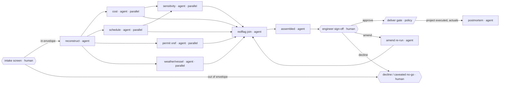

# AI-Native Architecture Blueprint — Decommissioning Intelligence (offshore wind, first-gen end-of-life)

## 1. Scope verdict

**Track A — greenfield.** Two founders, pre-revenue, no legacy graph to fight. There is no existing org chart, no incumbent workforce, no department to carve away from — so the diagnostic is run in its *inverted* (design-rule) form, not as a hit count.

One honest caveat that shapes everything below: this is a Track A venture sitting on a **safety-critical, litigation-exposed core**. That does not push it to the emotional-labor BOUNDARY — a removal plan is engineering judgment, not human relationship, so it is fully in scope — but it does mean the design must hold one human judgment node *harder* than a typical greenfield would, and must treat an adverse engineering call (a plan that is wrong in a way that kills a vessel campaign or breaches a permit) with the same care as the value-producing path. The architecture below is not "minimise the human." It is "concentrate the human onto the one thing that is irreducibly his, and feed everything else to agents that can prove their work."

---

## 2. Venture frame

- **Value & customer.** You sell an offshore-wind operator a **per-asset decommissioning dossier**: a costed, scheduled, permit-compliant removal plan, with its full reasoning trail, that the operator can put in front of a regulator and an insurer and have it *hold*. The customer is the asset owner's decommissioning lead — the person who has to defend a number and a sequence to people who can sue.
- **Core loop.** Ingest the messy project folder (installation records, permit, seabed survey, vessel day-rates, scrap forward curves) → reconstruct the asset and its constraints → model cost + generate a removal sequence → cross-reference every permit clause and weather/vessel constraint → **one engineer signs the dossier** → deliver a defensible, costed, scheduled plan with its audit trail.
- **Unit of coherence.** The **defensible dossier** — a single artifact whose every number and every sequencing decision traces back to a cited source and a recorded rationale. Coherence here is literal: the thing that holds the company together is that *any claim in any dossier can be reconstructed under deposition two years later*. That is the asset, not the headcount and not even the model.

The product is not "a plan." It is *a plan plus the proof of why the plan is safe to rely on*. The second half is what an operator is actually buying, because the first half is what gets them sued if it is wrong and unexplained.

---

## 3. T1 for this org (one line)

> **Judgment distribution:** one irreducible human node — the **co-founder's engineering sign-off on the sequenced, permit-checked removal plan** (plus a thin "is this dossier even in our competence envelope?" intake gate the operator-founder owns). **Context flow:** every dossier writes back a structured **constraint-and-rationale ledger** — permit-clause interpretations, vessel-window assumptions, cost build-ups, and *every point where the engineer overrode the agent* — into a versioned context store that the next dossier retrieves before it reasons.

The entire company is a machine for moving the engineer's scarce judgment off the 95% of the dossier that is reconstruction-and-modelling and onto the 5% that is "is this sequence actually safe, and does this permit clause mean what the agent thinks it means?"

---

## 4. Bottleneck diagnostic (greenfield — design rules, not a hit count)

The whole reason a one-engineer firm can plausibly serve more than five clients is that it *refuses to build in* the structural defects that would otherwise cap it. The five that bite this domain hardest, and the rule that keeps each one out:

- **B.01 Serial dependency chain → no default serial relay.** The naïve build is records → cost → schedule → permit, each waiting on the last, with the engineer at every hand-off. That is exactly the 17-engineer-day dossier that caps you at ~12/year. The rule: records reconstruction fans out into cost, schedule, and permit cross-reference *in parallel* off a shared reconstructed-asset object; they reconverge once, at one join, in front of one human.
- **B.03 Executive bandwidth ceiling → the engineer is a judgment node, not a workstation.** If the co-founder *produces* dossiers, the company's throughput is his calendar. The rule: he never assembles a dossier; he adjudicates one that is already assembled, with the agent's reasoning laid out for him to attack.
- **B.07 Tacit-knowledge lock-in → every override is captured, not just made.** The single most valuable thing in this company is the pattern of *how a senior offshore engineer reads an ambiguous permit clause or smells a bad weather-window assumption*. If that lives only in his head, the company is him, forever, and dies if he is sick. The rule (this is the heart of the design): the sign-off node is instrumented so that **every correction he makes is captured with its rationale as structured context**, and that context is what makes dossier #200 need less of his time than dossier #5.
- **B.09 Headcount-as-capacity → capacity scales on agents + context, not hires.** The instinct at client #6 is to hire a second engineer. The rule: the second engineer is the *last* lever, not the first; capacity comes from the agent layer getting better and the context ledger getting deeper, so the same one engineer reviews more dossiers per day over time.
- **B.11 Experiment cost → re-running a dossier under a changed assumption is ~free.** A consultancy re-models a project at the cost of analyst-weeks, so it explores two scenarios. The rule: "what if the scrap curve drops 15%, or the only available vessel is the smaller jack-up?" is a re-run of the agent pipeline at inference cost, so the dossier ships with a sensitivity band the incumbent can't afford to compute.

(The remaining eleven are considered and don't bite a two-person greenfield: B.02/B.04/B.06/B.14 are coordination/hierarchy taxes that don't exist at n=2; B.05/B.08 silo/approval-chain defects are pre-empted by having one loop and one gate; B.10/B.12/B.13/B.15/B.16 are scale-era pathologies to revisit only if the firm ever grows past a handful of humans — and the explicit design intent is that it shouldn't need to.)

---

## 5. Workflow graph — the core dossier loop

The shape of the whole company. Note the four things that make it *runnable* rather than a drawing: the parallel analytical branches reconverge at one explicit join (`assembled`) before any human sees them; the human sign-off declares a full verdict set and every non-approve verdict lands in a *named* node (a "decline" or "amend" cannot silently stall the company); the irreversible delivery gate sits behind that human, never behind an agent's classification; and every "writes back" claim is a real `feeds:` edge into a named store.

```yaml
workflow: decommissioning-dossier-core-loop
nodes:
  - id: intake_screen   ; type: human  ; owner: "operator-founder" ; parallelizable: false   # competence-envelope gate
  - id: reconstruct     ; type: agent  ; owner: ""                 ; parallelizable: false   # rebuild the asset + constraints from the folder
  - id: cost_model      ; type: agent  ; owner: ""                 ; parallelizable: true
  - id: schedule_gen    ; type: agent  ; owner: ""                 ; parallelizable: true
  - id: permit_xref     ; type: agent  ; owner: ""                 ; parallelizable: true    # clause-by-clause permit cross-reference
  - id: weather_vessel  ; type: agent  ; owner: ""                 ; parallelizable: true    # vessel-window feasibility check
  - id: sensitivity     ; type: agent  ; owner: ""                 ; parallelizable: true    # re-run under stressed assumptions
  - id: redflag_screen  ; type: agent  ; owner: ""                 ; parallelizable: false   # confidence + contradiction detector
  - id: assembled       ; type: agent  ; owner: ""                 ; parallelizable: false   # JOIN: dossier + reasoning trail + flagged items
  - id: eng_signoff     ; type: human  ; owner: "engineer-founder" ; parallelizable: false   # the one irreducible judgment
  - id: deliver_gate    ; type: policy ; owner: "engineer-founder" ; parallelizable: false   # irreversible: release to operator
  - id: amend_loop      ; type: agent  ; owner: ""                 ; parallelizable: false   # re-run pipeline on engineer's correction
  - id: decline_node    ; type: human  ; owner: "operator-founder" ; parallelizable: false ; terminal: true   # caveated no-go / out-of-competence exit
  - id: postmortem      ; type: agent  ; owner: ""                 ; parallelizable: false ; terminal: true   # writes outcome back when project is executed

edges:
  - { from: intake_screen,  to: reconstruct,    trigger: "folder accepted as in-envelope", feeds: "ctx/asset-registry" }
  - { from: intake_screen,  to: decline_node,   trigger: "out of competence / data too thin", feeds: "ctx/decline-log" }
  - { from: reconstruct,    to: cost_model,      trigger: "asset object built",  feeds: "ctx/asset-registry" }
  - { from: reconstruct,    to: schedule_gen,    trigger: "asset object built",  feeds: "ctx/asset-registry" }
  - { from: reconstruct,    to: permit_xref,     trigger: "asset object built",  feeds: "ctx/permit-ledger" }
  - { from: reconstruct,    to: weather_vessel,  trigger: "asset object built",  feeds: "ctx/asset-registry" }
  - { from: cost_model,     to: sensitivity,     trigger: "base cost built",     feeds: "ctx/cost-ledger" }
  - { from: schedule_gen,   to: sensitivity,     trigger: "base schedule built", feeds: "ctx/schedule-ledger" }
  - { from: cost_model,     to: redflag_screen,  trigger: "branch done",         feeds: "ctx/cost-ledger" }
  - { from: schedule_gen,   to: redflag_screen,  trigger: "branch done",         feeds: "ctx/schedule-ledger" }
  - { from: permit_xref,    to: redflag_screen,  trigger: "branch done",         feeds: "ctx/permit-ledger" }
  - { from: weather_vessel, to: redflag_screen,  trigger: "branch done",         feeds: "ctx/schedule-ledger" }
  - { from: sensitivity,    to: redflag_screen,  trigger: "bands computed",      feeds: "ctx/cost-ledger" }
  - { from: redflag_screen, to: assembled,       trigger: "flags + confidences attached", feeds: "ctx/rationale-ledger" }
  - { from: assembled,      to: eng_signoff,     trigger: "dossier + trail + flags ready", feeds: "ctx/rationale-ledger" }
  - { from: eng_signoff,    to: deliver_gate,    trigger: "verdict = approve",   feeds: "ctx/decision-log" }
  - { from: eng_signoff,    to: amend_loop,      trigger: "verdict = amend",     feeds: "ctx/override-ledger" }
  - { from: eng_signoff,    to: decline_node,    trigger: "verdict = decline",   feeds: "ctx/override-ledger" }
  - { from: amend_loop,     to: redflag_screen,  trigger: "corrected inputs re-run", feeds: "ctx/override-ledger" }
  - { from: deliver_gate,   to: postmortem,      trigger: "operator executes project; actuals returned", feeds: "ctx/outcome-ledger" }

joins:
  - id: sensitivity
    join_inputs: [cost_model, schedule_gen]    # stressed re-run needs both the base cost and base schedule
    join_policy: all
  - id: assembled
    join_inputs: [redflag_screen]      # redflag_screen itself joins the six analytical branches below
    join_policy: all
  - id: redflag_screen
    join_inputs: [cost_model, schedule_gen, permit_xref, weather_vessel, sensitivity]
    join_policy: all                   # no dossier reaches the human until ALL analytical branches AND the cross-checks complete
  - id: decline_node
    join_inputs: [intake_screen, eng_signoff]  # a case is declined at intake OR at sign-off — never both
    join_policy: mutually_exclusive_by: stage

verdict_sets:
  intake_screen: { approve: reconstruct, decline: decline_node }
  eng_signoff: { approve: deliver_gate, amend: amend_loop, decline: decline_node }

judgment_anchors: [intake_screen, eng_signoff]
policy_gates: [deliver_gate]
```



**Where the bottleneck moved.** Before any redesign, the bottleneck is the engineer's hands — 17 engineer-days of assembly per dossier, which is *why* the founder fears the five-client ceiling. After the redraw, the only thing on his critical path is `eng_signoff`: reading an already-assembled dossier with its reasoning exposed and its weak points flagged, and attacking the two or three things that actually carry liability. The bottleneck is now *one shared judgment*, not a relay of hand-offs — and that judgment is the only thing in the company that *should* be a bottleneck.

**The two non-obvious encodings that make this safe:**

1. **`redflag_screen` is not cosmetic — it is the mechanism that lets one human review fast without rubber-stamping.** It does three things, each checkable: (a) attaches a calibrated confidence to every load-bearing claim (cost line, permit interpretation, weather-window assumption); (b) runs contradiction detection across branches (does the schedule assume a vessel the cost model didn't price? does the permit clause forbid the seabed-disturbance method the sequence requires?); (c) routes **any near-threshold or low-confidence item into a mandatory-attention queue** the engineer cannot skip past to approve. The agent never *decides* a flagged item; it *surfaces* it so the human's scarce attention lands exactly where it's needed. This is what prevents the attestation trap — the gate is not "read 40 pages and initial it," it is "here are the four things the system is least sure about; rule on each."

2. **The negative path has the same care as the positive one.** A dossier that wrongly says "this is feasible and cheap" is the catastrophic output, so `eng_signoff` carries a full `{approve, amend, decline}` verdict set, and `decline` and `amend` are *named, owned nodes*, not dead ends. A `decline` (the plan can't be made safe, or the asset is out of the firm's competence) routes to a human-owned caveated-no-go that tells the operator *why* and hands back their folder — it never silently stalls. An `amend` re-runs the pipeline on the engineer's corrected input and writes the correction to `ctx/override-ledger`, which is the company's compounding asset. There is no path by which the system delivers a plan the engineer did not affirmatively approve.

**What each store holds and what reads it (the context layer is a system, not a label):**

| Store | What gets written | What reads it back |
|---|---|---|
| `ctx/asset-registry` | reconstructed asset objects: foundation type, mass, install method, soil data | every future dossier on a similar asset class; the cost & schedule agents |
| `ctx/permit-ledger` | clause-by-clause interpretations, with the engineer's overrides on ambiguous clauses | `permit_xref` on the next lease in the same regulatory regime — this is where permit reading compounds |
| `ctx/cost-ledger` + `ctx/schedule-ledger` | cost build-ups and sequences tied to vessel/scrap assumptions | `cost_model` / `schedule_gen` as priors; `sensitivity` as the perturbation base |
| `ctx/override-ledger` | **every engineer correction + its rationale** (the tacit-capture core) | the fine-tune / few-shot layer that makes the agent pre-empt the next override; the eval set |
| `ctx/decision-log` | every signed dossier: the claim, its source, the rationale, the sign-off | the **defense file** if a dossier is ever disputed — this *is* the auditability product |
| `ctx/outcome-ledger` | actuals when the operator executes (real vessel days, real cost vs. plan) | calibration of the cost/schedule agents — closes the loop from prediction to reality |

`ctx/outcome-ledger` is the one most firms would skip and the one that matters most: it is the edge that turns the company from "a model that sounds confident" into "a model whose past predictions can be scored against what actually happened offshore." Without that edge the self-improvement claim is prose. With it, every executed project makes the next estimate measurably better.

---

## 6. Four-layer substrate

Matched to a two-person firm — deliberately thin where thinness is safe, deliberately not thin where liability lives.

| Layer | Concrete choice | Why it is load-bearing *here* |
|---|---|---|
| **Model** | A frontier long-context API (for folder ingestion and multi-document reasoning) as primary, behind a thin swap shim; a second frontier provider wired as a fallback from day one; an **open-weight model held in reserve for the permit-cross-reference path** specifically, because permit text and proprietary install records are exactly the data an operator may contractually forbid you from sending to a third-party API. Single-vendor here isn't just lock-in risk — it's a *data-sovereignty* failure that could lose you a client contract. |
| **Agent** | A graph-based orchestrator (the loop above is literally a directed graph with joins, so an orchestration framework that models explicit nodes/edges/joins fits the domain) plus typed tool integrations: a cost-build-up tool, a schedule/critical-path tool, a metocean/weather-window data feed, and a scrap-forward-curve feed. The agents *call deterministic tools* for anything numeric — they do not free-hand arithmetic that has to survive a deposition. | This is where the abundant execution lives; keeping numeric work in deterministic, testable tools (not in the LLM) is what makes the output defensible. |
| **Context** | A versioned document + vector store for the project folders and a lightweight **knowledge graph for the permit/regulatory layer** (lease area → clause → interpretation → precedent), plus the seven ledgers above. The KG is justified *only* for permits — that's where relationships between clauses, precedents, and your prior interpretations actually compound; everything else can stay flat-and-vectorized. | This is what makes your agents *yours*: a generic model can't read this lease area's permit history the way yours can after 50 dossiers in the same regime. |
| **Observability** | Traces on every agent call; an **eval set seeded from the pilots' historical folders** (you already have ground-truth reconstructions to grade against); calibration tracking on `redflag_screen` confidences; and a review queue that routes low-confidence and contradiction-flagged items to the engineer. The eval set is non-negotiable from week one — a dossier company that scales an un-evaluated model is scaling liability. | Without it you scale a confidently-wrong plan faster than one engineer can catch it. For *this* firm, observability-last isn't a performance bug, it's a path to a lawsuit. |

What I defer: no fine-tuning until `ctx/override-ledger` has enough signed corrections to train on (few-shot from the ledger until then); no second human; no multi-region infra. Add fine-tuning when the override-ledger crosses ~50–100 corrections in a regime; add the open-weight permit path the moment a pilot's contract requires on-prem.

---

## 7. Org form, roles & the Coase boundary

**Two humans, two judgment anchors, nothing else.**
- **Engineer-founder → the sign-off anchor.** His job is *not* to build dossiers; it is to adjudicate the assembled ones, attacking the flagged items. Scrutiny is enforced structurally: `redflag_screen` hands him the system's least-confident claims and any cross-branch contradiction, so "approve" requires ruling on those specific items, not initialing a PDF. His incentive is aligned by the thing he can't delegate (below).
- **Operator-founder → the intake/competence anchor and the client relationship.** He owns the "should we even take this dossier?" gate and the caveated-no-go. He is the orchestrator: he steers the agent network and the client trust, he does not manage people.

**The Coase boundary — what to keep vs. buy:**
- **Buy from the market** (deep, competitive, low asset-specificity): cloud inference, vector/graph infra, orchestration framework, scrap-forward-curve data, metocean/weather data, base vessel day-rate indices. AI collapses the search/integration cost of wiring these in; none of them is relationship-specific, so renting is correct.
- **Keep in-house — and resist the instinct to outsource it** (high asset-specificity, thin-market, *this is the moat*): the **permit-interpretation context (`ctx/permit-ledger`) and the engineer's override pattern (`ctx/override-ledger`)**. These are the two nodes where hold-up risk is real — they are the company. A subtle trap: vessel-availability sits on the boundary. There are few heavy-lift vessels and the relationships are thin-market and relationship-specific; do *not* model vessel feasibility purely from a bought day-rate feed and treat vessels as freely substitutable. Hedge it — keep the *judgment* about whether a specific vessel can realistically be secured in the engineer's gate, even while buying the rate data.

**The regulated, irreversible action — named, not buried.** The irreversible act is **releasing a signed dossier an operator will rely on with a regulator and insurer.** The named accountable human is the engineer-founder; the gate is `deliver_gate`; and the dossier is governed by a real evidentiary standard, not just his signature:
- **Governing regime.** A removal plan offered for reliance is **expert-witness-grade engineering opinion**. In a UK/EU offshore context the operative standards are the relevant **maritime/offshore decommissioning regulator's approval requirements** (in the UK, OPRED decommissioning-programme approval under the Energy Act regime), and — when the dossier is later defended in a dispute — the **expert-evidence rules** (England & Wales: **CPR Part 35** and the duty to the court; in a US forum: **Daubert / FRE 702** reliability standards). The permit cross-reference must satisfy the *specific lease conditions and protected-feature designations* of that seabed area.
- **Instrument-of-record.** The document a court or insurer reads first is **not** the dossier — it is the **engagement letter defining the scope of reliance and the liability cap**, plus the **signed sign-off attestation** on each dossier that records *what the engineer reviewed and affirmed*. Name it in the contract: the operator may rely on the plan for X, the cap is Y, and reliance outside scope is excluded. This is what allocates the liability you're worried about.
- **Record obligation & liability transfer.** Every `ctx/decision-log` entry is retained immutable for the statutory limitation period plus margin (long — latent-defect and personal-injury claims can surface years after a campaign), under litigation-hold discipline. Carry **professional-indemnity / E&O insurance** sized to the per-project exposure; the engagement-letter cap and the PI policy together are what stand between a wrong dossier and the end of the company. This is a day-one cost, not a someday cost.

**Worldview/pillar fit.** The design sits cleanly on agent-as-default-worker, context-as-core-asset, continuous-learning-as-OS, and humans-as-judgment-anchors. On the sovereign-operator pillars it is deliberately a *two*-node sovereign shop, not N=1 (the engineering sign-off genuinely cannot be the same person as the client/intake judgment — separating them is a feature, not bloat); niche focus and strategic refusal are load-bearing (the `decline` node *is* strategic refusal wired into the graph). The one pillar held in tension: "un-scaling as design" coexists with a real growth path, because capability here scales on context depth, not heads — which is the point.

---

## 8. Construction plan, economics & exit criteria

### Phased ~6-month plan

**Phase 1 (months 1–2) — instrument one loop, end-to-end, on the pilots' real folders.** Build the core graph for *one* regulatory regime (whichever pilot's lease area you understand best), wired through to deterministic cost/schedule tools, with traces and the eval set seeded from the pilots' historical projects from day one. *Exit criterion:* the pipeline reconstructs both pilots' historical dossiers and the engineer agrees the output is at least as good as what a junior would hand him — and crucially, **measure the engineer-review-days per dossier**, because that number is the whole thesis (below).

**Phase 2 (months 3–4) — close the override loop.** Stand up `ctx/override-ledger` and `redflag_screen` calibration so every engineer correction is captured and starts pre-empting the next one. *Exit criterion:* review-days per dossier is trending *down* across successive dossiers, and `redflag_screen` is catching contradictions the engineer would otherwise have caught manually (measure its recall against his corrections).

**Phase 3 (months 5–6) — second regime + sensitivity-as-product.** Add a second regulatory regime (proving the permit-KG generalizes) and ship the sensitivity band as a sellable feature. *Exit criterion:* a paying dossier delivered in a regime you didn't pilot, signed at ≤3 engineer-review-days, with the operator's regulator/insurer accepting the audit trail.

### Economics (computed, anchored, banded)

**Opportunity, from the domain's own numbers.** A first-gen offshore wind farm is 30–100 turbines; decommissioning budgets run roughly **$30M–$120M** (industry estimates put removal at ~2–4% of CAPEX; per-turbine removal+disposal ~€200k–600k). The dossier de-risks two concrete things:
- *A stranded heavy-lift campaign* from a bad weather-window or vessel assumption. At a ~$200k/day vessel day-rate, a blown window costs re-mobilisation + standby of **$2.0M / $3.6M / $6.0M** (low/base/high, = $200k × 10/18/30 lost days). One avoided incident pays for the dossier ~30× over.
- *The bespoke study it replaces.* Operators pay consultancies **$150k–$400k** for a slow (3–6 month) decommissioning study today.

**Price and unit margin.** Price the dossier at **$120k** (below the incumbent study, above SaaS). Marginal cost is dominated by the engineer's review time, not inference:
- Hand-built: 17.5 engineer-days × $2,000/day + ~$700 API = **$35.7k/dossier**, capping output at **~12 dossiers/year** on one engineer (220 productive days ÷ 17.5).
- AI-core target: ~2.5 review-days × $2,000 + ~$700 API = **$5.7k/dossier** → **per-unit margin $114.3k (95%)**, capacity **~88 dossiers/year** on the *same one engineer*. That is the headcount-decoupling proof: **~7.3× the throughput with zero added heads.**

**Venture ROI.** Cash build over 6 months (founders' time is sunk equity): one part-time senior ML/infra contractor at ~$18k/mo × 6 = $108k, plus tooling (API + vector/graph + orchestration + observability) at ~$2.5k/mo × 6 = $15k → **~$123k cash build.** At a modest year-1 of 10 paying dossiers × $120k = **$1.2M revenue, ~$1.14M contribution margin**, the build pays back on **~2 dossiers (~2 months of year-1 volume).** The payback is trivially fast *if the thesis holds* — which routes to the one input that matters.

**The input whose error flips the recommendation: engineer-review-days per dossier.** Note carefully — unit margin stays positive across an enormous range (margin only hits zero at ~60 review-days, which is absurd). So margin is *not* the fragile input. The fragile input is **whether the AI core actually cuts review from 17.5 days to ~2.5**, because *that, not margin, is the entire reason to build this company.* If review only falls to ~8 days, the dossier still earns $103k margin — but capacity-leverage collapses from 7.3× to **~2.3×**, which means the firm caps at ~27 dossiers/year and the "scale past five clients without hiring" thesis is dead. The recommendation to build the agentic core (versus just hiring a second engineer) flips entirely on this number. **Phase 1's measured exit criterion is aimed squarely at it:** you find out whether review-days are heading toward 2.5 or stalling at 8 on your *own pilots' real folders* before you spend the back half of the build. That is the cheapest possible test of the only number that can kill the company.

**The two fragile inputs, banded.** (1) Review-days: low 1.5 / base 2.5 / high 4 → margin $116.3k / $114.3k / $111.3k, leverage 12× / 7.3× / 4.6× — the *leverage*, not the margin, is what swings, exactly as above. (2) Dossier price vs. the incumbent study: low $80k / base $120k / high $180k — at the floor of $80k the margin is still ~$74k and payback is ~2 dossiers, so price is robust; the model is far more sensitive to review-days than to price.

**Who builds it.** You are *not* a self-hostable-stack shop — neither founder is a full-time ML engineer. So the build is: managed frontier APIs + managed vector/graph + a managed orchestration/observability stack, assembled by **one part-time senior contractor** (the named hire) over the six months, after which the operator-founder maintains it as an orchestrator. Do not buy a GPU cluster; do not self-host a model until a client contract forces the open-weight permit path, at which point you provision *that one path* on managed infra.

### Traps & falsifiable risks

- **Over-automating the judgment.** The temptation, once `redflag_screen` is good, is to let the agent auto-approve "high-confidence" dossiers. Don't — confidence is calibrated against *past* projects, and the one that strands a vessel is the novel one the calibration hasn't seen. The gate stays human.
- **Context rot in the permit-ledger.** Regulations and lease conditions change; a stale permit interpretation is worse than none because it's confidently wrong. The override-ledger needs a freshness/expiry discipline on permit clauses, owned by the engineer.
- **Observability-last.** Already pre-empted by seeding the eval set in Phase 1 — but worth naming because the failure mode is silent until a wrong dossier ships.
- **Falsifiable risks (the conditions under which this design is wrong):** (a) if review-days stall at ~8 (above), the agentic-core thesis is falsified and the right move is a smaller "engineer-augmentation" tool, not a scaling company; (b) if permit interpretation does *not* generalize across regimes — if every lease area is so idiosyncratic that `ctx/permit-ledger` doesn't compound — the moat is local-only and the firm caps at the regimes it can hand-learn; (c) if operators won't accept an AI-assisted dossier's audit trail in front of *their* regulators, the auditability product is worth less than assumed (Phase 3's exit criterion tests exactly this).

---

## Residual harm — designing for when the gated engineer is *also* wrong

The gate assumes the engineer is the reliable last line. He won't always be. The design must hold for the dossier he approves that is nonetheless wrong, because that is what actually produces the harm.

**Trace it to the last human harmed — not "the operator."** A wrong dossier that approves an infeasible sequence doesn't injure an institution; it injures the **vessel crew working a heavy-lift in a window the plan said was safe**, and it can defame a **named contractor or original-install OEM** whose work the reconstruction blames. Those are the flesh-and-blood parties. So:
- **The error budget is set against the crew's worst case, not the operator's P&L.** Any sequence whose failure mode is a personnel-safety event (lift in marginal weather, dive against a misread seabed clause) is a *hard* mandatory-review item in `redflag_screen` — it cannot be auto-surfaced as "low risk" even at high model confidence.
- **A detection→disclosure→remediation edge that doesn't depend on the same signer's goodwill.** `ctx/outcome-ledger` is wired so that when actuals diverge materially from plan during execution (the operator reports a near-miss or a cost blowout), it routes back not just to model calibration but to a **named disclosure duty**: the operator is told, and any other live dossier sharing the wrong assumption is re-flagged. The duty is owed to the operator *and*, where a safety event occurred, triggers the mandatory-reporting path to the regulator — it is not left to the engineer to decide whether to mention it.
- **The third-party-harm vectors, named:** a wrongly-blamed contractor/OEM (→ negligent-misstatement / defamation exposure, addressed by the engagement-letter scope and a "findings are reconstruction, not allegation" framing in every dossier), and the crew (→ personal-injury, addressed by the hard-review rule above and the PI policy). The instrument that addresses each is the engagement letter's reliance scope and the PI/E&O policy; name them in the contract rather than discovering them in discovery.

## Beneficiary contract — proving the operator is better off, with an exit right

The operator is the end beneficiary, and the redesign has to make *their* position better, not just yours cheaper:
- **A beneficiary-voiced outcome signal, not an operator-tuned proxy.** The signal that the dossier worked is **the operator's regulator and insurer accepting it** — a verdict *they* produce, that you cannot quietly tune. Track regulator-acceptance and insurer-acceptance rate per dossier as the headline service metric; "we wrote a good plan" is not verifiable, "your regulator signed off on it" is.
- **A degraded-mode fallback.** When the pipeline's confidence is too low or a regime is genuinely novel, the operator doesn't get a confidently-wrong plan — they get the `decline` node's *caveated* output: "here's what we can stand behind, here's the gap we can't close, here's what we'd need." That honest partial is the human-touch fallback.
- **An exit / portability right, owned by the operator-founder.** The operator can take *their* reconstructed asset data and decision-log out and walk — their project folder and its dossier are theirs. You do **not** sell the operator's data-lock-in as your moat; your moat is the *cross-client permit and override context*, which is yours, while each operator's own dossier history is portable to them. Trust is structurally enforceable: they can verify the audit trail and leave with their data.

## Moat — the two-sided race, run honestly

The compounding asset is `ctx/permit-ledger` + `ctx/override-ledger` + `ctx/outcome-ledger`: a deepening, regime-specific record of how dossiers were reasoned, corrected, and how they turned out against reality.

- **The most likely attacker and their cheapest copy-path.** Not a startup — an **established offshore-engineering consultancy** that already has the engineers, the client relationships, and deeper historical archives, and bolts an LLM onto its existing study process. Their copy-path to the *tooling* is months; their archive is already deeper than yours.
- **The two-sided race, in real units.** Their advantage is the archive; *your* advantage is that you are compounding **calibrated, outcome-scored** context (predictions graded against `ctx/outcome-ledger` actuals) from day one, while their archive is un-scored study PDFs. The race is won not on who has more documents but on **who can put a defensible, regulator-accepted plan in front of an operator at lower review-cost and with a calibrated error band.** Your realistic lead, honestly: ~18–24 months of outcome-scored dossiers in your pilot regimes before a consultancy commits seriously — but only if you win the regimes deep, not broad (this is why niche-focus and the permit-KG generalization risk above are load-bearing). If permit context *doesn't* compound across regimes (falsifiable risk b), the consultancy with the broader archive wins, and you should stay a deep specialist in one regime rather than racing them on breadth.
- **The adversary-wins counterfactual.** The single exogenous event that collapses the moat: **a major consultancy acquires you for the outcome-scored dataset** rather than copying it — which is less a defeat than an exit, but it ends the independent company. The hedge is to keep the outcome-ledger and the client relationships as the thing of value, so an acquisition is on *your* terms. The genuine threat is the other one: an operator-side regulator publishes a *standardized* decommissioning-cost methodology that commoditizes the cost model — at which point your defensibility narrows to permit-interpretation and sequencing judgment, not cost. Watch for it; it's the condition under which half the product becomes a free good.
- **The switching cost.** Once an operator has two or three dossiers from you that their regulator accepted, the marginal cost of trusting your next one is far below the cost of re-establishing that acceptance trail with a competitor. The data-network effect is real but — per the beneficiary contract — it lives in *your cross-client context*, not in capturing the operator's own data against them.

---

## 9. Why this is AI-Native and future-leading

Delete the AI and this company does not become a slower consultancy — it *ceases to exist in this shape*. A consultancy is N engineers each hand-building dossiers at 17 engineer-days apiece; this is one engineer adjudicating dossiers an agent network assembled, at 2.5 review-days apiece. The org chart isn't "the same roles, slower." There are no analysts to slow down; the analysts are agents, and they are the default worker. That is the redraw.

The scarcity inversion is unusually clean here because the domain makes it concrete. Execution — reconstructing a messy folder, building a cost model, generating a critical-path schedule, cross-referencing forty permit clauses, computing a sensitivity band — is exactly the abundant, near-zero-marginal-cost work that agents now do well, and it is precisely the work that made the old dossier take 17 engineer-days. **Judgment** — "is this sequence actually safe; does this clause mean what the model thinks; can that vessel realistically be secured in that window" — is the scarce, value-and-liability-determining factor, and the architecture concentrates *all* of it onto one instrumented human gate. The company is, almost literally, a machine for separating those two and feeding the first to silicon while protecting the second.

The context compounds in a way a consultancy's never can. A consultancy's knowledge decays — it lives in the senior engineer's head and walks out when he retires (B.07). Here, the single most valuable thing in the firm — *how this engineer reads an ambiguous permit clause and smells a bad weather-window assumption* — is captured at the moment of every override, scored against what actually happened offshore via the outcome-ledger, and fed back so the next dossier needs less of his time and earns more of his trust. The firm's second year of dossiers is structurally smarter than its first, not because anyone wrote a better process, but because the context system grew. That is the self-improving, living-system property, and it is the source of the only durable advantage a two-person firm can hold against a consultancy with more engineers.

And the restraint is the point, not a gap: the design does *not* automate into the sacred core. The engineering sign-off, the safety-critical-sequence review, the decision to decline — these are elevated and protected, held by a named, liable human, precisely because that is where judgment is scarcest and most consequential. A version of this that auto-approved high-confidence dossiers would be *less* AI-Native, not more, because it would have misread which thing is abundant and which is scarce.

**Future-trajectory.** This compounds as the curves bend. Cheaper, longer-context models widen what the agent layer ingests in one pass (whole project archives, not chunked folders) and drive the marginal inference cost toward zero — pushing review-days down further and the leverage past 7.3×. The permit-KG and outcome-ledger deepen with every dossier, so the moat *widens* with use rather than depreciating. A2A protocols eventually let the dossier negotiate directly with vessel-operator and insurer systems, dissolving more of the Coase boundary you currently hold as human judgment. What must stay un-frozen to capture all of this: the swappable model layer (so a better or sovereign model drops in without redesign), the live override→calibration→eval loop (the moment it stops running, the firm stops compounding and becomes a static tool), and the human gate (frozen *open* on purpose — the day it closes is the day the liability the company was built to manage walks back in).

## 10. Redraw-vs-graft — one honest line

**No — it does not collapse back into an org chart.** Remove the agents and there is no company: the work that an org chart would assign to a team of analysts is the agent network's default load, and the single human is the justified exception holding the one judgment node that liability makes irreducible. The org doesn't exist in this shape without the agents — it would just be two people unable to build more than five dossiers a year, which is the very ceiling the founder came to escape.
