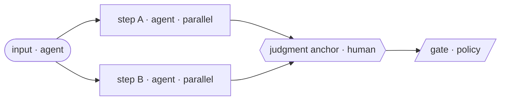

# Workflow Graph Template · 工作流图建模模板

Companion to SHEET 17 (Construction Toolkit). Turns **M.01 "the organization is its workflow
graph"** from a slogan into a scaffold you can fill in today. Copy this file → fill your loop in
four steps → render the Mermaid with any renderer.

## What it is
One page that draws an end-to-end workflow as a **graph**: nodes are work steps, edges are flow.
Three node types and four annotations — just enough to expose **which edge of the graph the
bottleneck sits on.** Throughput is a property of the graph, not of a node.

## Three node types
- **agent** — agent execution (the default worker, M.02). Generates / transforms / summarizes /
  executes at ~zero marginal cost.
- **human** — human judgment anchor (M.05). Decides what's worth doing, chooses among options, owns
  the consequences.
- **policy** — policy gate (a methodology pillar). An automatic gate before irreversible actions,
  plus exception escalation.

## Four annotations
- `parallelizable: true` — fan out in parallel (breaks the B.01 serial chain).
- `judgment_anchor` — where a human carries the consequences (M.05).
- `policy_gate` — must be signed off before an irreversible action.
- `feeds:` — writes compounding context (M.03 / M.04), retrievable downstream and in the future.

## Four executability annotations (what makes the graph *run*, not just draw)
These are what the validator (below) checks; the Validity-rules section explains *why*.
- `join_inputs: [a, b]` — on any node where parallel branches reconverge: its explicit
  wait-set. A node with ≥2 *concurrent* inbound edges that omits this is an implicit join
  (it deadlocks or races).
- `join_policy: all | quorum:N | mutually_exclusive_by:<guard>` — on any gate / join with
  >1 inbound edge: AND-join (`all`), wait-for-N (`quorum:N`), or alternative/exclusive paths
  (`mutually_exclusive_by:<verdict>`). Without it a multi-input gate releases on the first
  verdict to arrive — the failure this annotation prevents.
- `verdicts: [approve, decline, amend]` — on every human/community judgment node: its full
  verdict set. A node with only an implicit "approve" hides its negative paths.
- `routes: {decline: <node>, amend: <node>}` (or an edge annotated `on: decline`) — every
  non-approve verdict must terminate in a *named node*; a "NO" wired only into an `all`-join
  silently deadlocks it.
- `terminal: true` — marks a legitimate end node (a "done" / "passed" / "aborted" sink), so the
  validator doesn't mistake it for a stranded branch. Use it on real terminals; everything else
  must route onward.

## Four steps to fill it
1. **List nodes** — every step of one end-to-end workflow.
2. **Type them** (agent / human / policy) — **default to agent**; make a node `human` only when it
   needs judgment / accountability / a human relationship.
3. **Connect edges** (from → to); label each with `trigger` (what fires it) and `feeds` (what
   context it writes).
4. **Mark the four annotations** — which edges parallelize, which nodes are judgment anchors, which
   are irreversible gates, which write compounding context.

## Skeleton (YAML)
```yaml
workflow: <your workflow name>
nodes:
  - id: intake     ; type: agent  ; owner: ""           ; parallelizable: false
  - id: step_a     ; type: agent  ; owner: ""           ; parallelizable: true
  - id: step_b     ; type: agent  ; owner: ""           ; parallelizable: true
  - id: join       ; type: agent  ; owner: ""           ; join_inputs: [step_a, step_b]
  - id: judge      ; type: human  ; owner: "<judge>"    ; verdicts: [approve, decline, amend] ; routes: {decline: abort, amend: rework}
  - id: ship_gate  ; type: policy ; owner: "<sign-off>" ; join_inputs: [judge] ; join_policy: all
  - id: rework     ; type: agent  ; owner: ""
  - id: abort      ; type: agent  ; owner: ""           # named home for a "decline"
edges:
  - { from: intake,  to: step_a,    trigger: "new input arrives", feeds: "ctx/raw" }
  - { from: intake,  to: step_b,    trigger: "new input arrives", feeds: "ctx/raw" }
  - { from: step_a,  to: join,      trigger: "draft ready",       feeds: "ctx/draft" }
  - { from: step_b,  to: join,      trigger: "draft ready",       feeds: "ctx/draft" }
  - { from: join,    to: judge,     trigger: "both drafts in",    feeds: "ctx/draft" }
  - { from: judge,   to: ship_gate, trigger: "judgment passes",   on: approve, feeds: "ctx/decision-log" }
  - { from: judge,   to: abort,     trigger: "declined",          on: decline }
  - { from: judge,   to: rework,    trigger: "needs amendment",   on: amend }
  - { from: rework,  to: judge,     trigger: "re-review" }
judgment_anchors: [judge]
policy_gates: [ship_gate]
```
**Validate it:** `python3 ../../references/_core/scripts/validate_workflow_graph.py <this-file>`
— the checker enforces every rule below mechanically (exit 0 = runnable).

## Skeleton (Mermaid — renders directly)


## Worked example · VC research pipeline (before → after)
**before** (serial relay, flow efficiency <15%): request → one analyst researches item by item →
writes one report → IC reads each, week by week → decision. Even with AI accelerating the
*production* side, the *consumption* side stays single-threaded — total time is set by the serial
chain (B.01).

**after** (parallel fan-out + an explicit join + a single judgment node):
```yaml
workflow: VC-research-pipeline
nodes:
  - id: thesis    ; type: human  ; owner: "GP"        ; verdicts: [approve, decline] ; routes: {decline: pass_note}
  - id: scan_a    ; type: agent  ; owner: ""          ; parallelizable: true   # market
  - id: scan_b    ; type: agent  ; owner: ""          ; parallelizable: true   # competitors
  - id: scan_c    ; type: agent  ; owner: ""          ; parallelizable: true   # financials
  - id: synth     ; type: agent  ; owner: ""          ; join_inputs: [scan_a, scan_b, scan_c]  # explicit join — wait for all three
  - id: ic_judge  ; type: human  ; owner: "IC"        ; verdicts: [approve, decline, amend] ; routes: {decline: pass_note, amend: synth}
  - id: term_gate ; type: policy ; owner: "partner countersign" ; join_inputs: [ic_judge] ; join_policy: all
  - id: pass_note ; type: agent  ; owner: ""          ; join_inputs: [thesis, ic_judge] ; join_policy: mutually_exclusive_by: verdict ; terminal: true  # named home for a "no" — exactly one path arrives
edges:
  - { from: thesis,   to: scan_a,    trigger: "thesis set",     on: approve, feeds: "ctx/thesis" }
  - { from: thesis,   to: scan_b,    trigger: "thesis set",     on: approve, feeds: "ctx/thesis" }
  - { from: thesis,   to: scan_c,    trigger: "thesis set",     on: approve, feeds: "ctx/thesis" }
  - { from: thesis,   to: pass_note, trigger: "out of thesis",  on: decline, feeds: "ctx/pass-log" }
  - { from: scan_a,   to: synth,     trigger: "scan done",      feeds: "ctx/findings" }
  - { from: scan_b,   to: synth,     trigger: "scan done",      feeds: "ctx/findings" }
  - { from: scan_c,   to: synth,     trigger: "scan done",      feeds: "ctx/findings" }
  - { from: synth,    to: ic_judge,  trigger: "one-pager ready", feeds: "ctx/memo" }
  - { from: ic_judge, to: term_gate, trigger: "decision to advance", on: approve, feeds: "ctx/decision-log" }
  - { from: ic_judge, to: pass_note, trigger: "declined",       on: decline, feeds: "ctx/pass-log" }
  - { from: ic_judge, to: synth,     trigger: "needs more work", on: amend }
judgment_anchors: [thesis, ic_judge]   # framing and the call are human judgment
policy_gates: [term_gate]              # issuing a term sheet must be signed
```
Key: the three scans **fan out in parallel** (no longer serial) and **reconverge at an explicit
`synth` join** (`join_inputs` — the term-sheet gate can't fire until all three are in); the human
appears only at two judgment anchors (thesis, ic_judge), each declaring its **full verdict set** so
a "no" has a named home (`pass_note`) instead of silently stalling; `term_gate` gates the
irreversible action with `join_policy: all`. **The bottleneck moved from "reading reports one by
one" to "one shared judgment."** Run the validator on this block and it exits 0.

## Validity rules (so the graph would actually run)
A workflow graph that can't execute is a drawing, not an architecture. Three checks:
1. **Reconverge parallel branches.** Every fan-out must rejoin at an explicit `join` node before any
   delivery or irreversible/`policy` node. Dangling parallel branches (a node with no outgoing edge
   that isn't a true terminal) either deadlock or let a case complete while half its work floats.
   This applies to **judgment fan-outs** too: if an item can need two human verdicts, both must
   reach a `join` before the gate fires — never let the irreversible gate trigger on the first
   verdict in. **Encode it:** the `join` is a node with an explicit `join_inputs: [...]` wait-set,
   and any gate with more than one inbound edge declares a `join_policy` (`all` / `quorum:n` /
   `mutually_exclusive_by:<guard>`) — the bare two-edges-into-a-gate pattern releases on whichever
   verdict arrives first, the exact failure this rule prevents. Every conditional / escalation /
   refusal / disagreement branch must terminate in a **named node**, never dead-end in prose. And
   remember an **adverse decision is irreversible**: route a harmful "fail / reject / deny" (and any
   near-threshold / low-confidence case) through a human anchor, not an agent's call. **Every
   human/community judgment node declares its full verdict set `{approve, decline, amend}`, and each
   non-approve verdict terminates in a named node** (renegotiate / abort / caveated-finding) — a "NO"
   wired only as a YES-edge into an `all`-join silently deadlocks it, which is catastrophic precisely
   at the consent/sign-off node the design exists to protect. Say what the join does on a negative
   verdict.
2. **Every "learns / writes back" is a real edge.** If you claim a node feeds a lesson back into the
   context store (the immune-system / self-improving loop), that `feeds:` edge must appear in the
   YAML. A learning loop described only in prose does not exist.
3. **Resolve `feeds:` to a store.** For each store (`ctx/...`, `playbook/...`), say in one line what
   gets written and what reads it back — and what the validating/judging node actually checks
   against (a schema? a rules engine? an LLM judge? an eval set?). The linchpin nodes deserve more
   than a label.

## When to build one / when not to
- **Build it** when end-to-end throughput didn't improve after "adding AI," when you can't tell
  which edge the bottleneck is on, or when queues pile up at hand-offs.
- **Don't** over-build: a <5-person team where verbal alignment suffices doesn't need BPMN and a
  vector store first. **This is a scaffold, not the truth** — the graph exists to find the serial
  edges worth deleting, not for its own sake.
